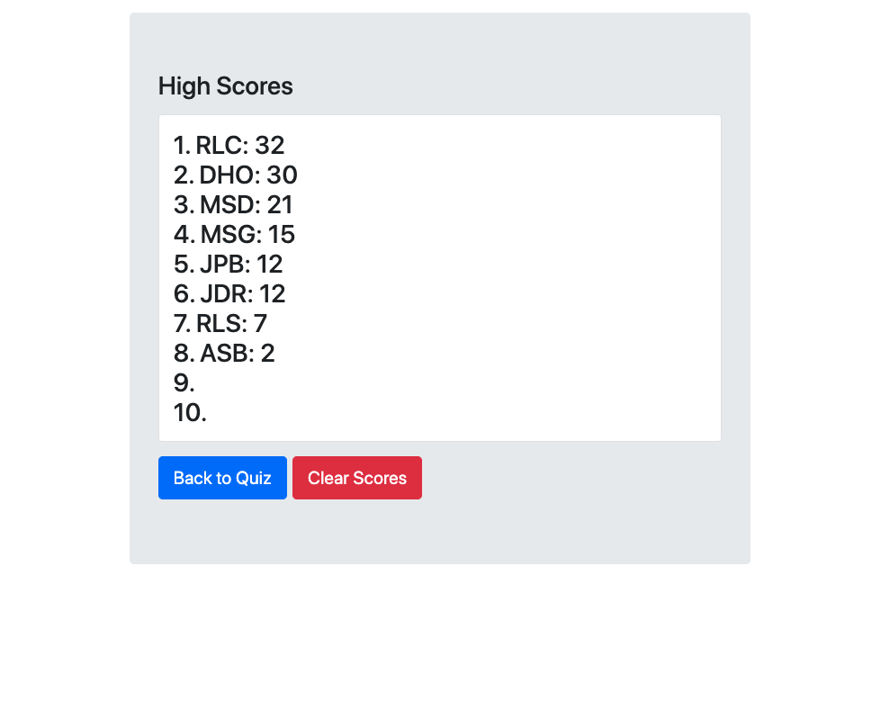

# Code Quiz
This web application gives users a timed JavaScript coding quiz and records high scores.

### Features:
- The quiz randomizes both the order questions are given and the order answers are shown.
- The user's progress through the queiz questions is tracked by an animated prgoress bar below the question card.
- The timer is dynamically styled - is yellow during the quiz, green if their score will be saved to the "High Scores" page, and red if they got a 0.
- The results message is also dynamically styled - flashing red for a wrong answer and green for a right answer, and dissapearing after a moment.
- When they user is given their result, they will have the option to retake the quiz for a higher score. If they scored more than 0, they can save their score to the "High Scores" page, but if they scored a 0 they can only retake the quiz.

## Screenshots
[View the deployed web application.](https://dandandanoneil.github.io/code-quiz/index.html)

Landing Page:

Quiz Question:

Quiz Result:

High Scores Page:

## Next Steps
I'm interested in developing this application in the following ways:
 - Adding new sets of question for other coding languages I've learned
 - Updating the CSS to make the design/layout more dynamic

> Written with [StackEdit](https://stackedit.io/).
